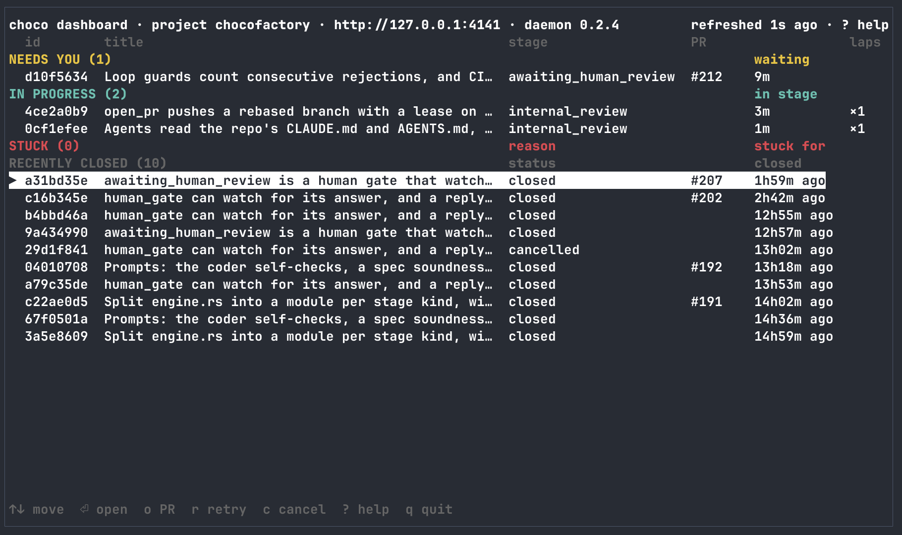

```text
                       ( (
                        ) )
      .-----.          ( (
      | | | |   _____   ) )
      |_|_|_|  |     |  |  |
   .--+-+-+-+--+-----+--+--+----------.
   | [==][==][==][==][==][==][==][==] |
   | [==][==][==][==][==][==][==][==] |
   | [==][==][==][==][==][==][==][==] |
   '----------------------------------'
    C  H  O  C  O  F  A  C  T  O  R  Y
```

# ChocoFactory

ChocoFactory runs AI coding agents as supervised workflows: an agent writes the change, a second agent reviews it, CI runs, and you give the final verdict on the pull request. You can hand it a spec and walk away. It is driven by the `choco` command line, backed by a background daemon, `chocofactoryd`.

Jump to [Install](#install), or see the [Documentation](#documentation) list.

## The problem

Handing a coding task to an AI agent and walking away goes wrong in familiar ways:

- **It stalls.** The agent waits on something, such as a test run, a timer or an answer, and never comes back.
- **It wanders off the spec.** Nothing checks the result against what you asked for.
- **It reviews its own work and approves it.** The same agent that wrote the change signs it off.
- **It loses its place.** A restart, a crash or a closed laptop ends the session, and the work is gone or half done.
- **It needs a human watching every step** to catch all of the above, which defeats the point.

## How ChocoFactory solves it

- **A workflow is a state machine.** Every task moves through explicit stages, and every transition is a named outcome. The built-in `coding-task` goes: code → internal review → open a PR → wait for CI → human review → done. Every way back (a rejected review, red CI, your `/request-changes`, a resumed escalation) goes through a revise stage, so there is one path for fixing things.
- **Several workflows come built in.** `coding-task` is the full pipeline above. `coding-task-planned` puts a planning agent in front: it checks the spec against the code and asks you only when it must. `chat` is a deliberately simple example, a single standing conversation with an agent.
- **A workflow is just a YAML file.** You, or your agents, can write your own workflows from scratch, or copy a built-in and change its stages, roles, models and prompts. Put them in your repo's `.chocofactory/workflows/` and the whole team shares them. See [Customising workflows](#customising-workflows).
- **Harnesses and models are per role.** Roles run on Claude Code by default. A role can run on [omp (oh-my-pi)](https://github.com/can1357/oh-my-pi) instead, which reaches other providers' models, so the coder and the reviewer can run different models. For example, a Claude coder with an OpenAI GPT reviewer, using your existing omp login:

  ```
  choco task create ... --role-cli reviewer=omp --role-model reviewer=openai-codex/gpt-5.6-terra
  ```

  See [Using choco with omp](docs/models.md#using-choco-with-omp).
- **A separate reviewer.** A different agent, in its own session and read-only, reviews the change against the spec before any PR exists. Read-only is enforced: the daemon checks that the worktree didn't change.
- **Loop guards and escalation.** Repeated rejections, repeated red CI, or no verdict from you for about four days (checked every minute at first, then less often) park the task for a human instead of looping forever. A turn that stops reporting is nudged, then marked stuck.
- **Tasks survive restarts.** Everything lives in the daemon's database. Waits survive a restart. Interrupted agent turns are parked and can be retried, resuming the agent's session when possible.
- **Your verdict lives on the PR.** Comment `/approve` or `/request-changes` on the pull request.
- **One dashboard** (`choco dashboard`) for every task: what needs you, what's running, what's stuck.
- **Each coding task gets its own git worktree**, so tasks don't step on each other or on your checkout.

## How it is used

You don't normally type the `choco task create` commands yourself. You work from a coding agent, such as Claude Code, that has been given the [`run-choco-task` skill](#using-choco-from-claude-code), which teaches it how to run choco.

1. You ask your agent to have choco implement something, for example "implement issue 42".
2. The agent writes a real spec for the task. The spec is the coding agent's whole brief, so it should be a spec, not one line.
3. The agent creates the task through choco's API, using the same command you could type:

   ```
   choco task create --project myapp --workflow coding-task \
     --title "Fix the login redirect (#42)" --prompt "$(cat spec.md)"
   ```

   It prints the task's id. Because the title ends in `(#42)`, the PR body will say `Closes #42`, so merging closes the issue.
4. The agent monitors the task, for example with `choco task status <id> --until attention --timeout 2h`, which returns when the task needs a person (a question, the review, an escalation) or has ended.
5. At the same time you can open `choco dashboard` in another terminal and watch the progress yourself.
6. When the task reaches human review, the PR is open (the branch is `task/<id>`). The agent, or you, reviews it and comments `/approve` (`gh pr comment <number> --body "/approve"`) or `/request-changes`. `/approve` moves the task to done. Merging (`gh pr merge <number> --squash`, or any merge method) is still yours to do, and merging on its own also counts as approval.

`myapp` and issue 42 are made up. The one-time setup before the first task is under [Quick start](#quick-start).

## Prerequisites

- **`claude` CLI**, logged in: see the [Claude Code quickstart](https://code.claude.com/docs/en/quickstart). Every agent turn runs it, so tasks cost real money.
- **`gh`**, authenticated as the account that opens the PRs: see [installing the GitHub CLI](https://github.com/cli/cli#installation) and run `gh auth login`.
- **`git`**: see [installing Git](https://git-scm.com/downloads).
- **`omp`** ([oh-my-pi](https://github.com/can1357/oh-my-pi)), installed and logged in. Needed only for roles that run on `cli: omp`; see [Using choco with omp](docs/models.md#using-choco-with-omp).

## Install

```
curl -fsSL https://github.com/itsypkin/ChocoFactory/releases/latest/download/install.sh | sh
```

- Installs `choco` and `chocofactoryd` into `~/.local/bin`.
- Platforms: macOS arm64 and x86_64, Linux x86_64 and aarch64.
- The two binaries always live **side by side** in one directory: `chocofactoryd` hands agents the `choco` next to it, and `choco server start` runs the `chocofactoryd` next to it.
- The installer's environment variables, checksum verification and installing from source are in [docs/cli.md](docs/cli.md#updating).

To update, run `choco update`. `choco update --check` only reports whether an update is available. A running daemon started from the install directory is restarted on the same port (`update` refuses with exit 3 while any work is in flight, an agent turn or a shell step, unless you pass `--force`); the built-in workflows update with the binary.

## Quick start

Set up once (`project create` is once per repo; start the daemon again after a reboot or logout, since nothing restarts it):

```
choco server start                          # background daemon; waits until it answers
choco server status                         # version, pid, port, open tasks
choco project create <name> --repo <path>   # register a repo
```

After that you only create tasks. Create one as in [How it is used](#how-it-is-used), and watch it in the [dashboard](#the-dashboard). The full walkthrough (statuses, cost and time, messages, cancelling, events) is in [docs/cli.md](docs/cli.md#a-full-walkthrough). If a task gets stuck, see [Stuck tasks](docs/cli.md#stuck-tasks).

## The dashboard

`choco dashboard` (alias `choco dash`) is an interactive terminal view of every task.



Its four sections:

| Section | Holds |
|---|---|
| Needs you | tasks waiting at a human gate, such as your PR verdict |
| In progress | every other open task |
| Stuck | tasks the engine could not move forward, with the reason |
| Recently closed | the latest finished and cancelled tasks |

Keys for day one:

| Key | Action |
|---|---|
| `⏎` | open the selected task's detail view |
| `o` | open the task's pull request |
| `r` | retry a stuck task |
| `c` | cancel a task |
| `?` | list all keys |
| `q` | quit |

The full key table, columns and behaviour are in [docs/cli.md](docs/cli.md#the-dashboard).

## Reviewing a PR

When a `coding-task` reaches `awaiting_human_review` it has already pushed a branch, opened a PR and waited for CI. It wants a verdict from you, and it reads that from a PR **comment** or from a GitHub **review**.

Leave a PR comment (or the body of a review) containing one of these markers, **alone on its own line**, with your review above it:

| Marker | Effect |
|---|---|
| `/approve` | the task moves to `done` |
| `/request-changes` | the task goes back to `revising`, and the coder gets your comment |

- Only comments and reviews newer than the head commit count, so there is nothing to clear between rounds.
- Only comments and reviews from the repo's owners, members and collaborators vote.
- A collaborator's **Approve** or **Request changes** review votes by itself. On your own PR GitHub only allows a **Comment** review, so put the marker alone on a line of its body.
- The inline comments on a review go to the coder with it. A pending (unsubmitted) review doesn't count.
- Merging the PR counts as approval too.
- `choco task send <id> --text ...` is the other channel: it answers without touching the PR, with the same markers.

The full rules (editing a comment, code blocks, the six-hour window, escalation counts, CI polling, how the PR body is written) are in [docs/coding-task.md](docs/coding-task.md#reviewing-a-coding-task-pr).

## Customising workflows

A task's workflow comes from the first of these that matches:

1. an explicit path: `choco task create --workflow <path-to.yaml>`;
2. the project repo's `.chocofactory/workflows/<name>.yaml`;
3. the built-in of that name, which ships inside the daemon.

`choco project init-workflows <project>` copies the built-ins into the project's repo as a starting point, so a team can version its own stages, roles, models and prompts next to the code.

**Trust warning:** a repo's workflows, and any `--workflow` file, can run shell commands as you. Only point choco at repos and files you trust.

More in [docs/workflows.md](docs/workflows.md). The `customize-choco-workflow` skill (see below) helps pick the lightest way to change a workflow and edit it safely.

## Using choco from Claude Code

Two skills are available:

- `run-choco-task` teaches Claude Code to drive a coding task end to end:
  write the spec, watch the task, review its PR and recover it.
- `customize-choco-workflow` helps you change a workflow: it picks between a
  per-task override, a workflow file and a repo workflow, and gives the
  rules for editing safely.

Copy the whole skill folders, including `scripts/` and `reference/`, into
your repo's `.claude/skills/` (or `~/.claude/skills/` for every repo). From
the repo's root:

```bash
dest=.claude/skills    # or ~/.claude/skills for every repo
ver=$(choco --version | awk '{print $2}')
d=$(mktemp -d) &&
  git -c advice.detachedHead=false clone --depth 1 --filter=blob:none --sparse --branch "v$ver" https://github.com/itsypkin/ChocoFactory.git "$d" &&
  git -C "$d" sparse-checkout set .claude/skills/run-choco-task .claude/skills/customize-choco-workflow &&
  mkdir -p "$dest" && rm -rf "$dest/run-choco-task" "$dest/customize-choco-workflow" &&
  cp -R "$d/.claude/skills/run-choco-task" "$d/.claude/skills/customize-choco-workflow" "$dest/" &&
  rm -rf "$d"
```

- `--branch "v$ver"` takes the skills from the release you run. They
  describe that release only, so fetch it again after `choco update`.
  Without `--branch` you get `main`'s copy, which can describe behaviour
  newer than your choco.
- A clone keeps `scripts/tail-events.sh` executable. If you fetch the files
  another way, such as the GitHub contents API, `chmod +x` it.
- A new Claude Code session finds the skills. In a running session, if the
  `skills/` folder you copied into didn't exist when it started, run
  `/reload-skills` or start a new session.

## Documentation

- [docs/cli.md](docs/cli.md): the `choco` CLI: flags, the daemon, updating, a full walkthrough, stuck tasks, scripting, watching tasks, the dashboard.
- [docs/coding-task.md](docs/coding-task.md): the built-in coding workflows, PR review rules, escalation limits, CI polling and the PR body.
- [docs/workflows.md](docs/workflows.md): writing and customising workflows: where they come from, routing on a verdict, isolation, read-only roles, human gates.
- [docs/models.md](docs/models.md): roles, CLIs and models, including running a role on omp.
- [CONTRIBUTING.md](CONTRIBUTING.md): building, tests, running the daemon by hand, environment variables, releasing.

## Contributing

See [CONTRIBUTING.md](CONTRIBUTING.md) for building from source, running the tests and releasing.

## License

Licensed under either of Apache License, Version 2.0 ([LICENSE-APACHE](LICENSE-APACHE))
or MIT license ([LICENSE-MIT](LICENSE-MIT)) at your option. Unless you explicitly state otherwise, any
contribution intentionally submitted for inclusion in the work by you, as defined in the Apache-2.0
license, shall be dual licensed as above, without any additional terms or conditions.
